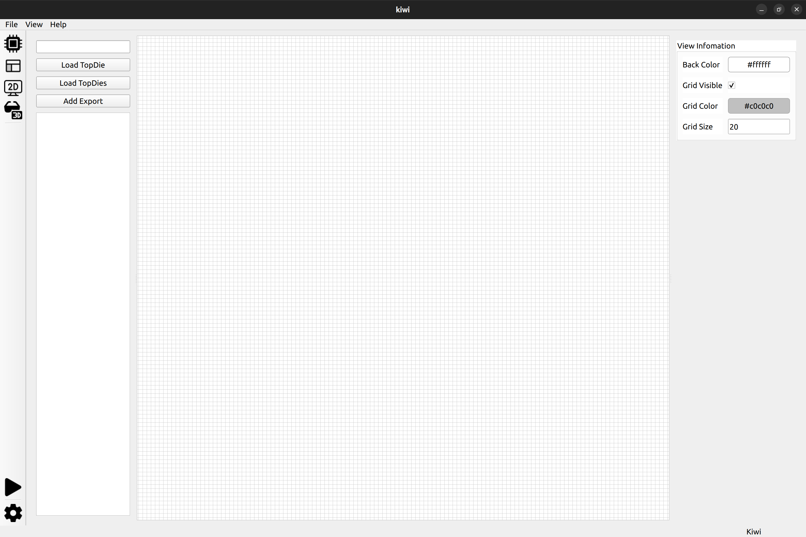
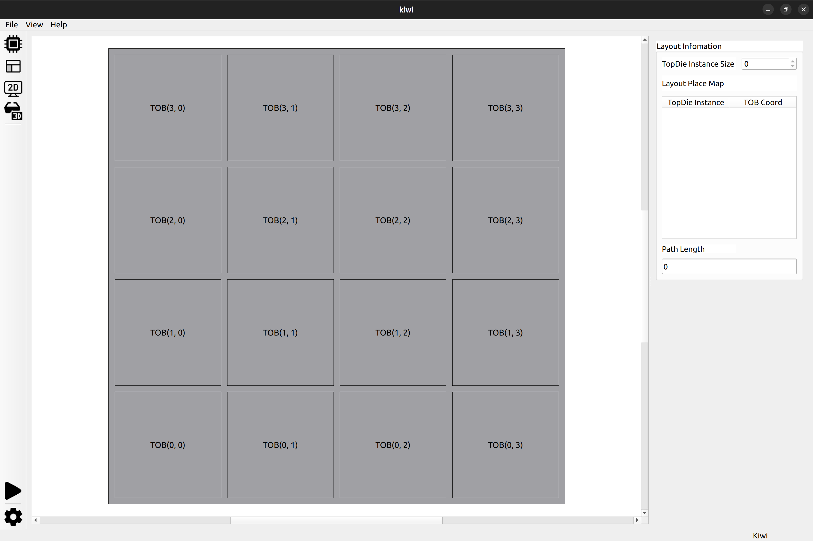
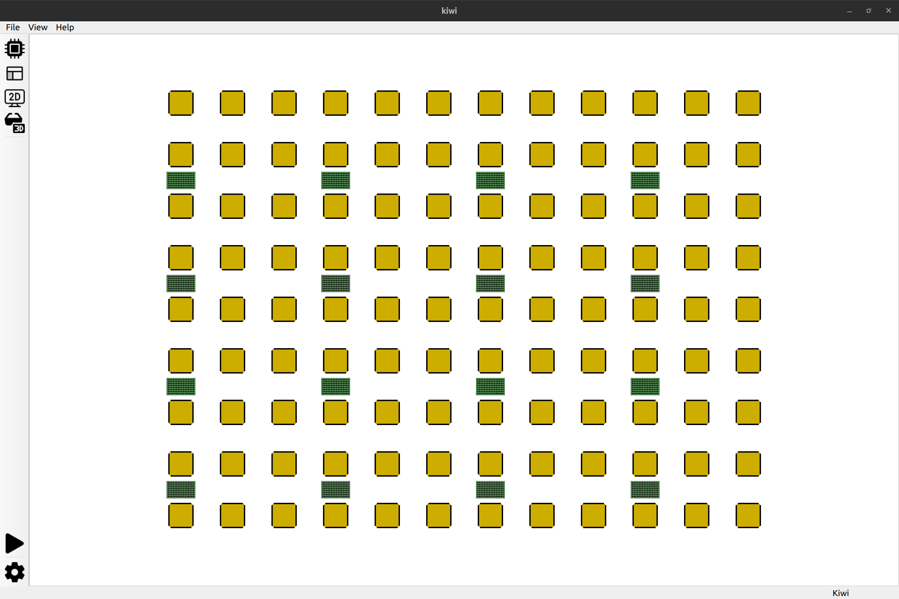
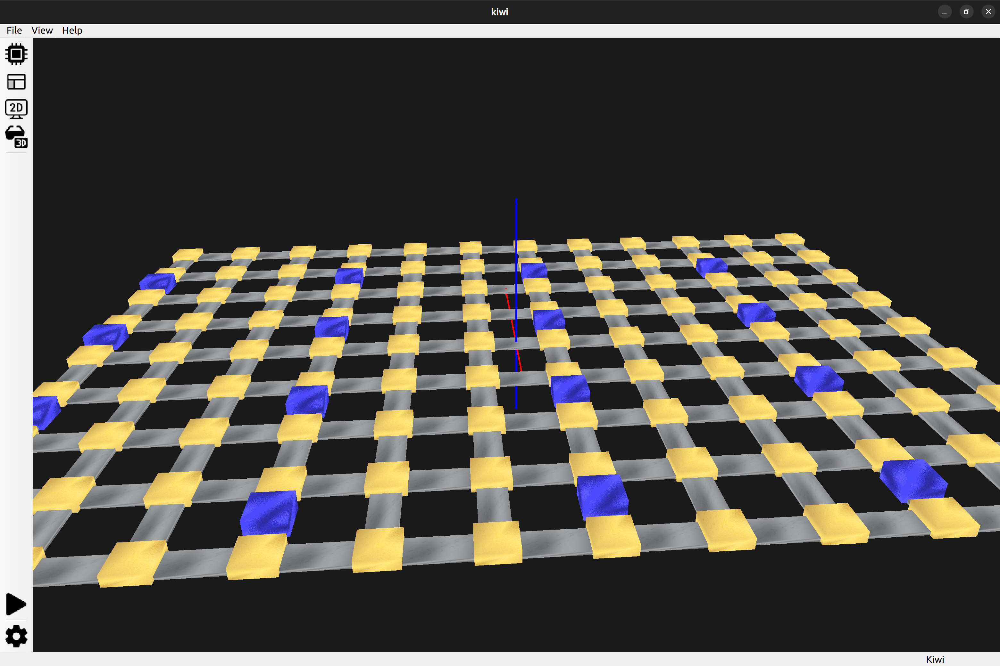

# GUI Flow

`-g` 选项进入 GUI 模式。系统会创建两个空的 `Interposer` 和 `BaseDie`，此时原理图为空，布局只有空的 TOB，2D、3D 视图只有硬件没有布线。

- 上方菜单栏：目前只支持 File 下的 Load，可以选择文件夹导入 config
- 左侧工具栏：
    - 前四个分别是：原理图、布局、2D 展示、3D 展示界面切换按钮
    - 运行 P&R：点击运行 P&R，过程中会弹出一个对话框等待，运行结束后 2D、3D 加载布线结果，前两个界面无法编辑
    - 设置按钮：还没写，留着之后修改硬件参数什么的
- 右侧窗口：上述四个界面的容器

可以从空白的配置自己绘制电路，然后布线。也可以直接导入（再修改）。

## 原理图

默认原理图为空，左侧 TopDie 库为空。

- 左侧 TopDie 栏：
    - 搜索框（没有实现）
    - Load TopDie：选择一个文件 josn 文件描述的 TopDie（文件名称为 TopDie 名词。）
    - Load TopDies：选择一个 json 文件（像 config 里面的 topdies.json 一样），包含多个 TopDie 信息
    - Add Export：点击按键鼠标进入绘图区域可以放置一个外部端口（默认使用 TrackCoord 的默认值，应该从空闲的选择一个，要修复！）
- 中间是原理图绘制区域：移动、删除、添加、连接各个元素
- 右侧信息区域：默认展示 View 信息，双击元素可以显示对应信息，有些支持修改

## 布局

- 布局区域：可以对已经存在的 TopDie Instance 进行交换位置（或在移动到空的 TOB 上，理论上 TopDieInstance 不可能没有 TOB!）
- 右侧信息：展示当前 Instance 数量、每个 Instance 的位置、估计的线长

因为布局窗口不会影响原理图。但原理图的很多修改都会影响布局，目前的处理是直接将布局直接重新加载，实现起来比较简单。而且你修改的时候展示的也不是布局界面，实际上也不会出现卡顿的情况。

## 2D 视图

展示布线结果。

TODO：TOB、COB 的详细视图展示

## 3D 视图

展示布线结果。

点击物体可以展示详细信息
